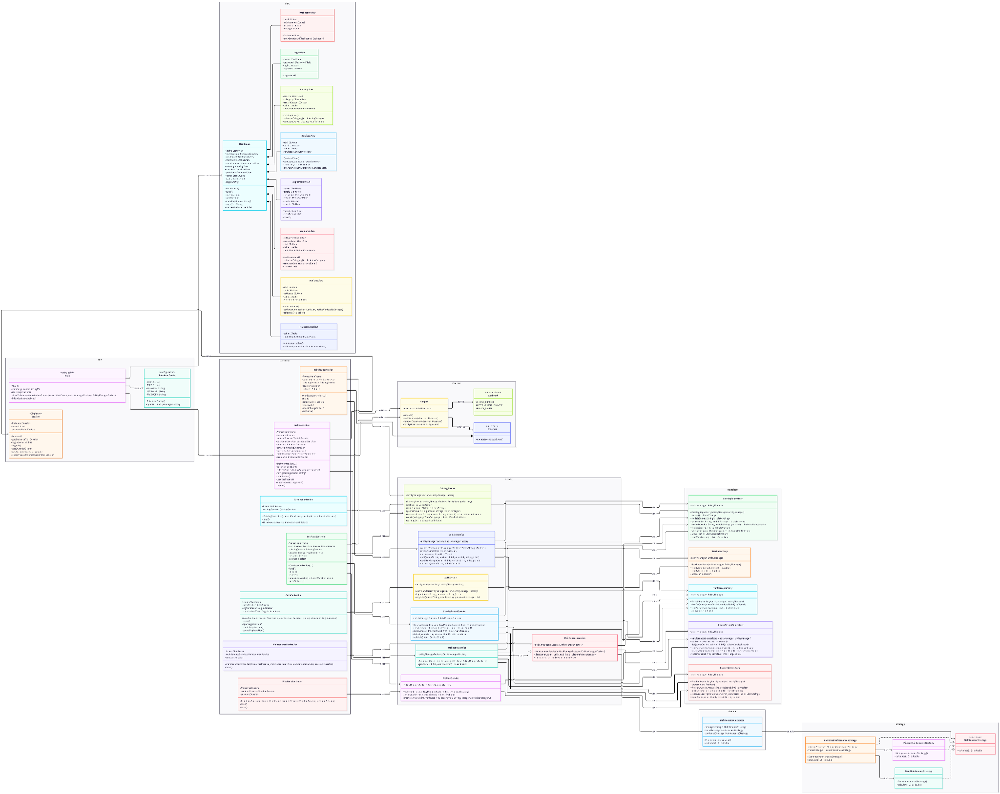
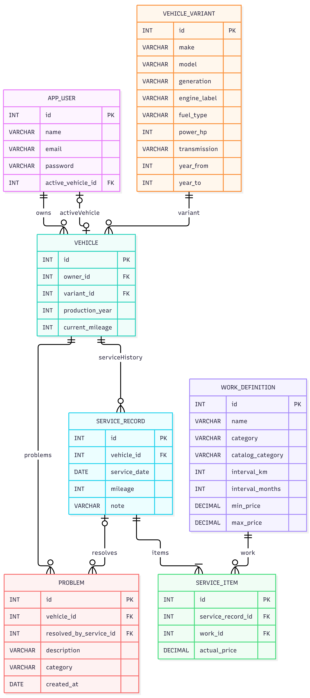
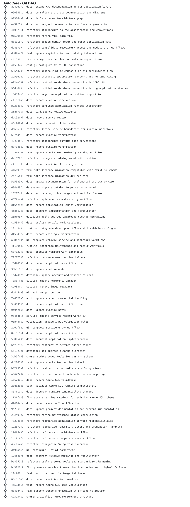

# AutoCare - dokumentacija samostalnog projektnog zadatka

**Kolegij:** Napredno objektno programiranje
**Projekt:** AutoCare
**Vrsta aplikacije:** Java Swing desktop aplikacija povezana s Azure SQL bazom podataka

## 1. Opis problema

AutoCare je desktop aplikacija namijenjena vlasniku vozila koji želi na jednom mjestu voditi osnovne podatke o svojim vozilima, servisnu povijest, stvarne troškove servisa, intervale održavanja i probleme koje želi evidentirati prije odlaska u servis. Aplikacija dodatno sadrži informativni katalog standardnih zahvata s okvirnim rasponima cijena.

Korisnik može imati više vozila. Jedno vozilo u svakom trenutku može biti odabrano kao aktivno vozilo. Aktivno vozilo predstavlja kontekst za Dashboard, Održavanje, Servise i Probleme. Katalog je opći informativni pregled standardnih radova i ne ovisi o aktivnom vozilu.

Aplikacija rješava nekoliko povezanih problema. Korisniku omogućuje da ne vodi servisnu povijest u odvojenim bilješkama, da razlikuje okvirnu cijenu rada od stvarno plaćenog iznosa, da vidi kada se približava sljedeće održavanje te da evidentirani problem poveže sa servisom kojim je taj problem riješen.

## 2. Opis rješenja i konceptualni model

Aplikacija je organizirana prema MVC pristupu uz dodatno odvojene Service i Repository odgovornosti. Time je korisničko sučelje odvojeno od poslovnih postupaka i pristupa bazi podataka.

Glavne odgovornosti slojeva su:

- **View** - Swing forme, paneli, dijalozi i tablice. View prikazuje podatke i omogućuje unos, ali ne pristupa izravno bazi.
- **Controller** - reagira na korisničke događaje, čita podatke iz Viewa, poziva odgovarajući Service i osvježava prikaz.
- **Service** - provodi konkretne use-caseove aplikacije. Service povezuje više repozitorija i domenskih pravila, otvara `EntityManager` te određuje transakcijske granice za operacije koje mijenjaju podatke.
- **Domain** - sadrži poslovne objekte i pravila koja pripadaju domeni aplikacije. U tom su paketu i persistentni entiteti, ali domain nije ograničen samo na tablice baze. Primjer je `MaintenanceCalculator`, koji predstavlja pravilo izračuna održavanja i nema vlastitu tablicu.
- **Repository** - sadrži JPA/JPQL dohvat i spremanje podataka. Repository dobiva postojeći `EntityManager` i ne određuje cijeli poslovni postupak.

`Main` je ulazna točka aplikacije i ručno povezuje glavne komponente. Pri pokretanju postavlja Swing izgled, preko `DatabaseConfig.open()` stvara zajednički `EntityManagerFactory`, zatim stvara Service objekte, `MainFrame`, `Session`, `Subject` i `MainController`. Time je sastavljanje aplikacije smješteno na jednom mjestu bez korištenja dodatnog dependency injection frameworka.

`EntityManagerFactory` postoji tijekom rada cijele aplikacije, dok Service metode otvaraju `EntityManager` za konkretnu operaciju. Repository objekti dobivaju isti `EntityManager` koji je otvorio Service. Kod operacija koje mijenjaju više povezanih zapisa, kao što je spremanje servisa, Service određuje jednu transakciju kako bi cijeli postupak uspio ili se u slučaju pogreške poništio kao cjelina.

`Session` čuva identitet prijavljenog korisnika i aktivno vozilo. Aktivno vozilo je zajednički kontekst više ekrana, pa se ta informacija ne prenosi ručno između svakog Viewa i Controllera.

## 3. GUI wireframeovi i opis korisničkog sučelja

Wireframeovi prikazuju glavne ekrane i korisničke tokove aplikacije: prijavu, vozila, Dashboard, održavanje, katalog, servise i probleme.

[Otvori GUI wireframeove (PDF)](assets/AutoCare_GUI_Wireframes_FINAL.pdf)

## 4. UML dijagram klasa i detaljan opis

UML dijagram prikazuje glavne klase potrebne za razumijevanje konstrukcije aplikacije i njihovih međusobnih ovisnosti. Prikaz je organiziran prema stvarnim paketima projekta i naglašava glavni tok `View -> Controller -> Service -> Repository`, dok su Observer i Strategy dijelovi izdvojeni tako da ne zaklanjaju osnovnu arhitekturu.

Dijagram namjerno ne prikazuje svaki getter, setter i svaki mali pomoćni detalj. Njegov cilj nije preslikati svaku liniju izvornog koda, nego prikazati odgovornosti klasa, njihove konstruktore, važnije metode i veze koje objašnjavaju kako aplikacija radi.

### 4.1. Paket `app`

`Main` je početna klasa aplikacije. Metoda `main` prebacuje pokretanje sučelja na Swing Event Dispatch Thread. `startApplication` otvara bazu, stvara Service objekte i glavne aplikacijske objekte te na kraju prikazuje `MainFrame`. `closeDatabaseWhenWindowCloses` osigurava zatvaranje `EntityManagerFactoryja` kada se zatvori glavni prozor. `initializeLookAndFeel` postavlja FlatLaf i osnovne UI vrijednosti.

`DatabaseConfig` izdvojeno sadrži parametre potrebne za sastavljanje JDBC URL-a i kroz metodu `open` poziva `Persistence.createEntityManagerFactory`. Time detalji spajanja na bazu nisu razasuti po Service ili Repository klasama.

`Session` implementira Singleton pristup. Jedna instanca čuva `ownerId` prijavljenog korisnika i `activeVehicle`. `login` postavlja identitet korisnika, `logout` čisti stanje, a `setActiveVehicle` mijenja trenutačni kontekst vozila.

### 4.2. Paket `view`

`MainFrame` je glavni Swing prozor. Sadrži glavne View panele i navigaciju. Metode `auth`, `registration` i `application` mijenjaju glavni prikaz između prijave, registracije i aplikacijskog dijela, dok `showPage` mijenja aktivnu aplikacijsku stranicu. `context` prikazuje podatke aktivnog vozila u zajedničkom dijelu sučelja.

`LoginView` i `RegistrationView` predstavljaju forme za autentikaciju. `DashboardView` prikazuje pripremljeni `Dashboard` objekt. `VehiclesView` prikazuje korisnikova vozila i omogućuje izbor označenog vozila. `MaintenanceView` prikazuje izračunate `MaintenanceRow` retke. `CatalogView` prikazuje standardne radove i omogućuje filtriranje. `ServicesView` prikazuje servisnu povijest i detalje odabranog servisa. `ProblemsView` prikazuje otvorene i riješene probleme te omogućuje unos novog problema.

Pomoćni dijalozi `VehicleDialog`, `MileageDialog` i `ServiceEditorDialog` dio su konkretnih korisničkih tokova. `VehicleForm` predstavlja ponovno upotrebljivu formu za izbor marke, modela, godine i varijante vozila. `Ui` centralizira ponavljajuće Swing layout funkcije, formatiranje vrijednosti, parsiranje unosa i standardne poruke. Te pomoćne klase postoje u izvornom kodu, ali nisu sve prikazane kao zasebni UML elementi kako bi glavni dijagram ostao čitljiv.

### 4.3. Paket `controller`

Controlleri povezuju korisničko sučelje sa Service slojem. Oni registriraju Swing listenere, preuzimaju unos iz Viewa, pozivaju odgovarajuću poslovnu operaciju i nakon toga osvježavaju prikaz.

`MainController` je središnji Controller za navigaciju i zajednički kontekst aplikacije. Stvara specifične Controllere, reagira na uspješnu prijavu, učitava aktivno vozilo, odabire koji ekran treba osvježiti i provodi odjavu. Budući da implementira `Observer`, reagira i na događaje koji nastaju nakon promjena vozila ili spremanja servisa.

`AuthController` upravlja prijavom i registracijom. `VehiclesController` učitava vozila, otvara dijalog za dodavanje, mijenja kilometražu i aktivira odabrano vozilo. `VehicleFormController` upravlja ovisnim izborima marka -> model -> godina -> varijanta. `CatalogController` učitava katalog i primjenjuje korisnički filter. `ServicesController` učitava servisnu povijest, prikazuje detalj i otvara unos novog servisa. `MaintenanceController` učitava izračune održavanja. `ProblemsController` učitava i sprema probleme aktivnog vozila.

### 4.4. Paket `service`

Service sloj provodi poslovne postupke aplikacije. Za razliku od pojedinačnog domenskog pravila, Service koordinira više koraka jednog use-casea: otvara `EntityManager`, provjerava kontekst korisnika, koristi jedan ili više Repository objekata, poziva domenska pravila i prema potrebi upravlja transakcijom.

`AuthService` provodi prijavu i registraciju. Kod prijave pronalazi korisnika i provjerava vjerodajnice, a kod registracije provjerava unos i sprema novog korisnika.

`VehicleService` dohvaća korisnikova vozila, određuje aktivno vozilo, dodaje novo vozilo, mijenja kilometražu i postavlja aktivno vozilo. Pri svakoj operaciji koja radi s konkretnim vozilom provjerava da vozilo pripada prijavljenom korisniku.

`CatalogService` predstavlja čitljivu granicu prema kataloškim podacima. Controlleru daje marke, modele, godine, varijante, radove i cijeli katalog bez potrebe da View ili Controller poznaju JPQL upite.

`ServiceRecordService` provodi jedan od složenijih use-caseova. Pri spremanju servisa provjerava ulaz, dohvaća vozilo i katalog radova, stvara `ServiceRecord`, dodaje `ServiceItem` stavke sa stvarnim cijenama, po potrebi ažurira kilometražu vozila i povezuje odabrane probleme sa servisom koji ih je riješio. Ti se koraci izvršavaju u jednoj transakciji.

`MaintenanceService` servisnu povijest koristi kao izvor istine za održavanje. Za svaki rad održavanja pronalazi posljednju spremljenu stavku, priprema datum i kilometražu sljedećeg intervala te koristi `MaintenanceCalculator` za izračun koliko je intervala preostalo.

`ProblemService` dohvaća i sprema probleme aktivnog vozila. Problem se ovdje ne označava proizvoljno riješenim; rješavanje se povezuje sa spremanjem konkretnog servisa.

`DashboardService` spaja više izvora podataka potrebnih za četiri sažetka Dashboarda: aktivno vozilo, ukupni stvarni servisni trošak, broj otvorenih problema i najbliže održavanje.

### 4.5. Paket `repository`

Repository sloj skriva JPA/JPQL detalje od viših slojeva. Svaki Repository dobiva `EntityManager` kroz konstruktor. Na taj način više Repository objekata unutar istog Service use-casea može koristiti isti persistence context i istu transakciju.

`UserRepository` dohvaća korisnika prema e-mailu ili ID-u i sprema novog korisnika. `VehicleRepository` dohvaća vozilo određenog vlasnika, sva vozila vlasnika i sprema vozilo. `CatalogRepository` dohvaća marke, modele, godine, varijante i definicije radova. `ServiceRecordRepository` sprema servis, dohvaća servisnu povijest, servisni detalj, povijesne stavke i ukupni trošak. `ProblemRepository` sprema problem, dohvaća probleme vozila, provjerava pripadnost korisniku, vraća opise problema riješenih određenim servisom i broj otvorenih problema.

Repository ne odlučuje kada se cijeli poslovni postupak commit-a. Transakcijsku granicu određuje Service koji zna koje operacije pripadaju jednom use-caseu.

### 4.6. Paket `domain`

Domain sadrži poslovne objekte i pravila. Persistentni entiteti `AppUser`, `Vehicle`, `VehicleVariant`, `WorkDefinition`, `ServiceRecord`, `ServiceItem` i `Problem` mapirani su na bazu, ali domain nije isto što i popis tablica.

`AppUser` predstavlja korisnika i njegovu vezu prema aktivnom vozilu. `Vehicle` predstavlja konkretno korisnikovo vozilo i omogućuje kontrolirano ažuriranje kilometraže. `VehicleVariant` opisuje katalošku varijantu vozila i može provjeriti obuhvaća li određenu proizvodnu godinu. `WorkDefinition` opisuje standardni rad, njegovu kategoriju, interval i informativni raspon cijene. `ServiceRecord` predstavlja jedan stvarni servis i sadrži njegove `ServiceItem` stavke. `Problem` predstavlja evidentirani problem i zna povezati svoje rješenje s konkretnim servisom.

`Checks` sadrži zajednička pravila validacije korisničkog unosa. `MaintenanceCalculator` nije tablica baze nego domensko pravilo. Dobiva podatke o servisnom intervalu i odabire odgovarajuću Strategy implementaciju za izračun preostalog dijela intervala.

Enum tipovi `WorkCategory`, `CatalogCategory` i `ProblemCategory` ograničavaju dopuštene kategorije na poznate vrijednosti i time sprječavaju proizvoljne tekstualne vrijednosti kroz aplikaciju.

### 4.7. Paket `model`

`Data` sadrži male pomoćne tipove koji nisu zasebni persistentni domenski entiteti. `ItemInput` i `ServiceInput` predstavljaju podatke forme za spremanje servisa. `ServiceRow` i `ServiceDetail` pripremaju podatke za prikaz servisne povijesti. `MaintenanceRow` predstavlja rezultat izračuna jednog održavanja. `Dashboard` grupira podatke koje prikazuje Dashboard ekran.

Ti tipovi postoje zato da Controller i View ne moraju ručno prenositi velik broj nepovezanih vrijednosti kroz zasebne parametre.

### 4.8. Paket `observer`

Observer obrazac koristi se kada promjena u jednom dijelu aplikacije zahtijeva osvježavanje drugog dijela, ali Controlleri ne trebaju biti čvrsto povezani izravnim međusobnim pozivima.

`Observer` definira metodu `update(AppEvent)`. `MainController` implementira to sučelje. `Subject` čuva registrirane Obserere i kroz `notifyObservers` šalje događaj svima. `AppEvent` definira događaje `VEHICLE_CHANGED`, `ACTIVE_VEHICLE_CHANGED` i `SERVICE_SAVED`.

`VehiclesController` i `ServicesController` objavljuju događaj nakon promjene podataka. `MainController` reagira učitavanjem aktivnog konteksta i odgovarajućeg ekrana. Time Controller koji je izvršio promjenu ne mora poznavati ostale Controllere koje je potrebno osvježiti.

### 4.9. Paket `strategy`

Strategy obrazac odvaja više načina izračuna održavanja iza zajedničkog sučelja `MaintenanceStrategy`. `MileageMaintenanceStrategy` računa interval prema kilometraži, `TimeMaintenanceStrategy` prema vremenu, a `CombinedMaintenanceStrategy` koristi oba kriterija i uzima kriterij koji ranije dospijeva.

`MaintenanceCalculator` na temelju toga postoje li kilometarski interval, vremenski interval ili oba bira odgovarajuću strategiju. Time formula nije smještena u veliki niz `if` grananja u Service klasi, nego je svaki način izračuna odvojen u vlastitu implementaciju.

### 4.10. Pomoćne klase koje nisu zasebno nacrtane

Pomoćne klase nisu izostavljene zato što nisu važne, nego zato što bi zaseban box i veze za svaku od njih zaklonili glavnu arhitekturu. U tu skupinu pripadaju `VehicleDialog`, `MileageDialog`, `ServiceEditorDialog`, `VehicleForm`, `VehicleFormController`, `Ui` i pomoćni `Data` tipovi.

`VehicleDialog` i `MileageDialog` su mali modalni dijalozi za konkretan unos. `ServiceEditorDialog` je složeniji dijalog koji skuplja podatke novog servisa i pretvara ih u `ServiceInput`. `VehicleForm` je zajednička forma za izbor varijante vozila, a `VehicleFormController` upravlja njezinim ovisnim izborima. `Ui` uklanja ponavljanje Swing layouta, formatiranja i parsiranja. `Data` tipovi služe prijenosu pripremljenih podataka između slojeva.

## 5. ERD baze podataka i detaljan opis

Persistentni model sadrži sedam glavnih tablica: `APP_USER`, `VEHICLE`, `VEHICLE_VARIANT`, `WORK_DEFINITION`, `SERVICE_RECORD`, `SERVICE_ITEM` i `PROBLEM`.

### 5.1. APP_USER

`APP_USER` predstavlja korisnički račun. Primarni ključ je `id`. `name`, `email` i `password` čuvaju podatke računa. `active_vehicle_id` je strani ključ prema `VEHICLE` i predstavlja vozilo koje je korisnik trenutačno odabrao kao aktivno.

### 5.2. VEHICLE_VARIANT

`VEHICLE_VARIANT` je katalog varijanti vozila. Sadrži marku, model, generaciju, oznaku motora, gorivo, snagu, mjenjač te raspon godina proizvodnje. Jedna kataloška varijanta može biti povezana s više konkretnih korisničkih vozila.

### 5.3. VEHICLE

`VEHICLE` predstavlja konkretno vozilo korisnika. `owner_id` povezuje vozilo s vlasnikom, a `variant_id` s kataloškom varijantom. `production_year` je godina konkretnog vozila, dok `current_mileage` predstavlja trenutačno evidentiranu kilometražu.

Veza `APP_USER -> VEHICLE` označena s `owns` predstavlja vlasništvo: jedan korisnik može imati više vozila, a svako vozilo pripada jednom korisniku. Veza `activeVehicle` ima drugu svrhu: `APP_USER.active_vehicle_id` pokazuje koje je od korisnikovih vozila trenutačno aktivno u aplikaciji.

### 5.4. WORK_DEFINITION

`WORK_DEFINITION` predstavlja standardni kataloški zahvat. `category` razlikuje održavanje i popravak, dok `catalog_category` daje detaljniju grupu za filtriranje u katalogu. `interval_km` i `interval_months` definiraju servisne intervale kada se rad prati kroz održavanje. `min_price` i `max_price` predstavljaju samo informativni raspon cijene.

### 5.5. SERVICE_RECORD

`SERVICE_RECORD` predstavlja jedan stvarni servis vozila. Povezan je s jednim vozilom kroz `vehicle_id` i sadrži datum servisa, kilometražu pri servisu i opcionalnu napomenu. Jedno vozilo može imati više servisnih zapisa.

### 5.6. SERVICE_ITEM

`SERVICE_ITEM` predstavlja jednu stvarno izvedenu stavku unutar servisa. Povezana je sa servisom kroz `service_record_id` i s definicijom rada kroz `work_id`. `actual_price` je stvarno plaćena cijena te konkretne stavke.

Time se jasno razlikuju dvije vrste cijena: `WORK_DEFINITION.min_price/max_price` su informativna procjena, dok je `SERVICE_ITEM.actual_price` stvarni korisnikov trošak.

### 5.7. PROBLEM

`PROBLEM` predstavlja problem koji je korisnik evidentirao za vozilo. `vehicle_id` povezuje ga s vozilom. `description`, `category` i `created_at` opisuju problem i vrijeme evidentiranja. `resolved_by_service_id` je opcionalni strani ključ prema `SERVICE_RECORD`.

Dok `resolved_by_service_id` nema vrijednost, problem je otvoren. Kada se pri spremanju servisa problem poveže sa servisom koji ga je riješio, problem se smatra riješenim. Zbog toga nije potreban zaseban statusni stupac koji bi duplicirao istu informaciju.

## 6. Primijenjeni principi i obrasci dizajna

### 6.1. MVC

MVC odvaja prikaz od reakcije na korisničke događaje i poslovnih postupaka. View ne dohvaća podatke iz baze, Controller ne sadrži JPQL upite, a Repository ne upravlja Swing elementima. Takva podjela olakšava praćenje odgovornosti pojedine klase i lokalizira promjene.

### 6.2. Singleton - `Session`

`Session` koristi Singleton jer aplikaciji tijekom rada treba jedno zajedničko stanje prijavljenog korisnika i aktivnog vozila. Konstruktor je privatan, a `getInstance()` vraća jedinu instancu. Time različiti Controlleri koriste isti kontekst bez stvaranja više nepovezanih session objekata.

### 6.3. Observer - `Subject`, `Observer`, `AppEvent`

Observer se koristi za obavještavanje o promjenama koje utječu na više ekrana. Controller koji spremi promjenu objavljuje događaj kroz `Subject`, dok `MainController` kao `Observer` odlučuje što treba osvježiti. Ovim se smanjuje izravna ovisnost između pojedinačnih Controllera.

### 6.4. Strategy - izračun održavanja

`MaintenanceStrategy` definira zajednički ugovor za izračun preostalog dijela servisnog intervala. Posebne implementacije obrađuju kilometarski, vremenski i kombinirani interval. `MaintenanceCalculator` odabire strategiju prema podacima definicije rada. Kod kombiniranog intervala relevantan je kriterij koji prije dospijeva.

### 6.5. Enkapsulacija i odgovornost domenskih objekata

Domenski objekti ne služe samo kao strukture podataka. `Vehicle.updateMileage`, `AppUser.activate`, `Problem.resolve` i `ServiceRecord.addItem` primjer su operacija koje mijenjaju stanje kroz jasno imenovane metode. Time se promjena stanja ne raspršuje kroz Controller ili View sloj.

### 6.6. Repository i transakcijske granice

Repository skriva persistence upite, a Service određuje granicu poslovne operacije. Kod spremanja servisa više Repository objekata može koristiti isti `EntityManager` i istu transakciju. To je važno jer servis, stavke, kilometraža i riješeni problemi moraju ostati međusobno usklađeni.

## 7. Vanjske biblioteke, paketi i Maven

Projekt koristi Maven za upravljanje zavisnostima i build procesa. Verzije su definirane u `pom.xml`.

| Komponenta | Verzija | Namjena | Službena dokumentacija |
|---|---:|---|---|
| Jakarta Persistence API | 3.2.0 | Standardni API za objektno-relacijsko mapiranje i rad s `EntityManagerom` | https://jakarta.ee/specifications/persistence/3.2/ |
| Hibernate ORM | 7.4.8.Final | JPA provider koji implementira persistence i ORM mapiranje | https://hibernate.org/orm/documentation/7.4/ |
| Microsoft JDBC Driver for SQL Server | 13.4.0.jre11 | JDBC veza prema Microsoft SQL Serveru i Azure SQL Database | https://learn.microsoft.com/sql/connect/jdbc/ |
| FlatLaf | 3.6.2 | Moderni Swing Look and Feel korišten za izgled aplikacije | https://www.formdev.com/flatlaf/ |
| Ikonli Swing | 12.4.0 | Integracija vektorskih ikona u Swing komponente | https://kordamp.org/ikonli/ |
| Ikonli FontAwesome 6 pack | 12.4.0 | FontAwesome skup ikona korišten u navigaciji i karticama | https://kordamp.org/ikonli/ |
| Maven Compiler Plugin | 3.14.1 | Kompajliranje projekta uz Java release definiran u `pom.xml` | https://maven.apache.org/plugins/maven-compiler-plugin/ |
| Maven JAR Plugin | 3.4.2 | Izrada JAR paketa i definiranje glavne klase | https://maven.apache.org/plugins/maven-jar-plugin/ |
| Maven Dependency Plugin | 3.8.1 | Kopiranje runtime zavisnosti u `target/lib` | https://maven.apache.org/plugins/maven-dependency-plugin/ |
| Maven Javadoc Plugin | 3.12.0 | Generiranje HTML API dokumentacije iz Javadoc komentara | https://maven.apache.org/plugins/maven-javadoc-plugin/ |

Projekt ne koristi Hibernate kao zamjenu za vlastitu arhitekturu aplikacije. Hibernate je persistence implementacija ispod JPA API-ja, dok su Controller, Service i Repository odgovornosti definirane u vlastitom kodu.

## 8. API dokumentacija - Javadoc

Javadoc je HTML dokumentacija API-ja generirana iz komentara u Java kodu.

[Otvori Javadoc dokumentaciju](javadoc/index.html)

## 9. Git aciklički graf povijesti repozitorija

Git DAG prikazuje commitove i njihove međusobne veze u povijesti repozitorija. Generiran je iz Git povijesti i dodan u dokumentaciju kao SVG.

## 10. Prilozi

- [UML dijagram klasa](assets/UML.png)
- [ERD baze podataka](assets/ERD.png)
- [GUI wireframeovi (PDF)](assets/AutoCare_GUI_Wireframes_FINAL.pdf)
- [Git DAG](assets/Git_DAG.svg)
- [Javadoc HTML dokumentacija](javadoc/index.html)
