# AutoCare - UML dijagram klasa

UML je izrađen u **Mermaid notaciji**. Prikazuje glavne aplikacijske klase, važne atribute, konstruktore, glavne metode i ključne ovisnosti. Namespaceovi odgovaraju stvarnim paketima izvornog koda.

Radi čitljivosti, veze su nacrtane samo kada grafički objašnjavaju važan arhitekturni odnos. Ovisnosti koje su već jasno vidljive iz atributa klase ne ponavljaju se dodatnom strelicom ako bi to nepotrebno povećalo broj križanja linija.

```mermaid
classDiagram
direction LR

namespace app {
  class Main {
    <<entry point>>
    -Main()
    +main(arguments: String[])
    -startApplication()
    -closeDatabaseWhenWindowCloses(frame: MainFrame, entityManagerFactory: EntityManagerFactory)
    -initializeLookAndFeel()
  }

  class DatabaseConfig {
    <<configuration>>
    -HOST: String
    -PORT: String
    -DATABASE: String
    -USERNAME: String
    -PASSWORD: String
    -DatabaseConfig()
    +open(): EntityManagerFactory
  }

  class Session {
    <<Singleton>>
    -instance: Session
    -ownerId: int
    -activeVehicle: Vehicle
    -Session()
    +getInstance(): Session
    +login(ownerId: int)
    +logout()
    +getOwnerId(): int
    +getActiveVehicle(): Vehicle
    +setActiveVehicle(activeVehicle: Vehicle)
  }
}

namespace view {
  class MainFrame {
    +login: LoginView
    +registration: RegistrationView
    +dashboard: DashboardView
    +vehicles: VehiclesView
    +maintenance: MaintenanceView
    +catalog: CatalogView
    +services: ServicesView
    +problems: ProblemsView
    -roots: CardLayout
    -pages: CardLayout
    -page: String
    +MainFrame()
    +auth()
    +registration()
    +application()
    +showPage(name: String)
    +page(): String
    +context(vehicle: Vehicle)
  }

  class LoginView {
    +email: JTextField
    +password: JPasswordField
    +login: JButton
    +register: JButton
    +LoginView()
  }

  class RegistrationView {
    +name: JTextField
    +email: JTextField
    +password: JPasswordField
    +repeat: JPasswordField
    +finish: JButton
    +cancel: JButton
    +RegistrationView()
    +clearPasswords()
    +reset()
  }

  class DashboardView {
    -total: JLabel
    -maintenance: JLabel
    -problems: JLabel
    -mileage: JLabel
    +DashboardView()
    +showDashboard(dashboard: Dashboard)
  }

  class VehiclesView {
    +add: JButton
    +edit: JButton
    +activate: JButton
    +table: JTable
    -vehicles: List~Vehicle~
    +VehiclesView()
    +setRows(values: List~Vehicle~, activeVehicleId: Integer)
    +selected(): Vehicle
  }

  class MaintenanceView {
    +table: JTable
    -tableModel: DefaultTableModel
    +MaintenanceView()
    +setRows(values: List~MaintenanceRow~)
  }

  class CatalogView {
    +search: JTextField
    +category: JComboBox
    +searchButton: JButton
    +table: JTable
    -tableModel: DefaultTableModel
    +CatalogView()
    +selectedCategory(): CatalogCategory
    +setRows(works: List~WorkDefinition~)
  }

  class ServicesView {
    +add: JButton
    +detail: JButton
    +table: JTable
    -services: List~ServiceRow~
    +ServicesView()
    +setRows(values: List~ServiceRow~)
    +selected(): ServiceRow
    +showServiceDetails(detail: ServiceDetail)
  }

  class ProblemsView {
    +category: JComboBox
    +description: JTextArea
    +add: JButton
    +table: JTable
    -tableModel: DefaultTableModel
    +ProblemsView()
    +selectedCategory(): ProblemCategory
    +setRows(values: List~Problem~)
    +clearEditor()
  }
}

namespace controller {
  class MainController {
    -frame: MainFrame
    -session: Session
    -vehicleService: VehicleService
    -dashboardService: DashboardService
    -vehicles: VehiclesController
    -catalog: CatalogController
    -services: ServicesController
    -maintenance: MaintenanceController
    -problems: ProblemsController
    +MainController(...)
    -enter(ownerId: int)
    -refreshContext(showDashboard: boolean)
    -navigate(pageName: String)
    -loadVisible()
    -loadDashboard()
    +update(event: AppEvent)
    -logout()
  }

  class AuthController {
    -frame: MainFrame
    -authService: AuthService
    -loginListener: LoginListener
    -registrationView: RegistrationView
    +AuthController(frame: MainFrame, authService: AuthService, loginListener: LoginListener)
    -login()
    -openRegistration()
    -finishRegistration()
    -cancelRegistration()
  }

  class VehiclesController {
    -frame: MainFrame
    -vehicleService: VehicleService
    -catalogService: CatalogService
    -session: Session
    -subject: Subject
    +VehiclesController(...)
    +load()
    -selected(): Vehicle
    -showAdd()
    -showMileageEditor()
    -activate()
  }

  class CatalogController {
    -frame: MainFrame
    -catalogService: CatalogService
    +CatalogController(frame: MainFrame, catalogService: CatalogService)
    +load()
    -filterRows(allWorks: List~WorkDefinition~)
  }

  class ServicesController {
    -frame: MainFrame
    -serviceRecordService: ServiceRecordService
    -catalogService: CatalogService
    -problemService: ProblemService
    -session: Session
    -subject: Subject
    +ServicesController(...)
    +load()
    -detail()
    -create()
    -loadEditorWorks(): List~WorkDefinition~
    -openEditor(...)
  }

  class MaintenanceController {
    -frame: MainFrame
    -maintenanceService: MaintenanceService
    -session: Session
    +MaintenanceController(frame: MainFrame, maintenanceService: MaintenanceService, session: Session)
    +load()
  }

  class ProblemsController {
    -frame: MainFrame
    -problemService: ProblemService
    -session: Session
    +ProblemsController(frame: MainFrame, problemService: ProblemService, session: Session)
    +load()
    -save()
  }
}

namespace service {
  class AuthService {
    -entityManagerFactory: EntityManagerFactory
    +AuthService(entityManagerFactory: EntityManagerFactory)
    +login(email: String, password: String): int
    +register(name: String, email: String, password: String): int
  }

  class VehicleService {
    -entityManagerFactory: EntityManagerFactory
    +VehicleService(entityManagerFactory: EntityManagerFactory)
    +list(ownerId: int): List~Vehicle~
    +active(ownerId: int): Vehicle
    +add(ownerId: int, variantId: int, year: int, mileage: int)
    +updateMileage(ownerId: int, vehicleId: int, mileage: int)
    +activate(ownerId: int, vehicleId: int)
  }

  class CatalogService {
    -entityManagerFactory: EntityManagerFactory
    +CatalogService(entityManagerFactory: EntityManagerFactory)
    +makes(): List~String~
    +models(make: String): List~String~
    +years(make: String, model: String): List~Integer~
    +variants(make: String, model: String, year: int): List~VehicleVariant~
    +works(category: WorkCategory): List~WorkDefinition~
    +catalog(): List~WorkDefinition~
  }

  class ServiceRecordService {
    -entityManagerFactory: EntityManagerFactory
    +ServiceRecordService(entityManagerFactory: EntityManagerFactory)
    +create(ownerId: int, vehicleId: int, input: ServiceInput)
    +list(ownerId: int, vehicleId: int): List~ServiceRow~
    +detail(ownerId: int, serviceId: int): ServiceDetail
    -validate(input: ServiceInput)
  }

  class MaintenanceService {
    -entityManagerFactory: EntityManagerFactory
    +MaintenanceService(entityManagerFactory: EntityManagerFactory)
    +list(ownerId: int, vehicleId: int): List~MaintenanceRow~
    ~calculate(...): List~MaintenanceRow~
  }

  class ProblemService {
    -entityManagerFactory: EntityManagerFactory
    +ProblemService(entityManagerFactory: EntityManagerFactory)
    +list(ownerId: int, vehicleId: int): List~Problem~
    +create(ownerId: int, vehicleId: int, description: String, category: ProblemCategory)
  }

  class DashboardService {
    -entityManagerFactory: EntityManagerFactory
    +DashboardService(entityManagerFactory: EntityManagerFactory)
    +get(ownerId: int, vehicleId: int): Dashboard
  }
}

namespace repository {
  class UserRepository {
    -entityManager: EntityManager
    +UserRepository(entityManager: EntityManager)
    +findByEmail(email: String): AppUser
    +findById(id: int): AppUser
    +add(user: AppUser)
  }

  class VehicleRepository {
    -entityManager: EntityManager
    +VehicleRepository(entityManager: EntityManager)
    +findForOwner(ownerId: int, vehicleId: int): Vehicle
    +findAllForOwner(ownerId: int): List~Vehicle~
    +add(vehicle: Vehicle)
  }

  class CatalogRepository {
    -entityManager: EntityManager
    +CatalogRepository(entityManager: EntityManager)
    +makes(): List~String~
    +models(make: String): List~String~
    +years(make: String, model: String): List~Integer~
    +variants(make: String, model: String, year: int): List~VehicleVariant~
    +findVariant(id: int): VehicleVariant
    +works(category: WorkCategory): List~WorkDefinition~
    +allWorks(): List~WorkDefinition~
    +findWork(id: int): WorkDefinition
  }

  class ServiceRecordRepository {
    -entityManager: EntityManager
    +ServiceRecordRepository(entityManager: EntityManager)
    +add(serviceRecord: ServiceRecord)
    +list(ownerId: int, vehicleId: int): List~ServiceRecord~
    +findForOwner(ownerId: int, serviceId: int): ServiceRecord
    +historyItems(ownerId: int, vehicleId: int): List~ServiceItem~
    +total(ownerId: int, vehicleId: int): BigDecimal
  }

  class ProblemRepository {
    -entityManager: EntityManager
    +ProblemRepository(entityManager: EntityManager)
    +add(problem: Problem)
    +findForOwner(ownerId: int, problemId: int): Problem
    +list(ownerId: int, vehicleId: int): List~Problem~
    +resolvedDescriptions(ownerId: int, serviceId: int): List~String~
    +openCount(ownerId: int, vehicleId: int): long
  }
}

namespace observer {
  class Subject {
    -observers: List~Observer~
    +Subject()
    +addObserver(observer: Observer)
    +removeObserver(observer: Observer)
    +notifyObservers(event: AppEvent)
  }

  class Observer {
    <<interface>>
    +update(event: AppEvent)
  }

  class AppEvent {
    <<enumeration>>
    VEHICLE_CHANGED
    ACTIVE_VEHICLE_CHANGED
    SERVICE_SAVED
  }
}

namespace domain {
  class MaintenanceCalculator {
    -mileageStrategy: MaintenanceStrategy
    -timeStrategy: MaintenanceStrategy
    -combinedStrategy: MaintenanceStrategy
    +MaintenanceCalculator()
    +calculate(...): double
  }
}

namespace strategy {
  class MaintenanceStrategy {
    <<interface>>
    +calculate(...): double
  }

  class MileageMaintenanceStrategy {
    +MileageMaintenanceStrategy()
    +calculate(...): double
  }

  class TimeMaintenanceStrategy {
    +TimeMaintenanceStrategy()
    +calculate(...): double
  }

  class CombinedMaintenanceStrategy {
    -mileageStrategy: MileageMaintenanceStrategy
    -timeStrategy: TimeMaintenanceStrategy
    +CombinedMaintenanceStrategy()
    +calculate(...): double
  }
}

%% Glavni aplikacijski tok
Main --> DatabaseConfig : opens
Main --> MainFrame : creates
Main --> MainController : creates
MainFrame *-- LoginView
MainFrame *-- RegistrationView
MainFrame *-- DashboardView
MainFrame *-- VehiclesView
MainFrame *-- MaintenanceView
MainFrame *-- CatalogView
MainFrame *-- ServicesView
MainFrame *-- ProblemsView

%% Controller -> Service veze
AuthController --> AuthService : uses
VehiclesController --> VehicleService : uses
VehiclesController --> CatalogService : uses
CatalogController --> CatalogService : uses
ServicesController --> ServiceRecordService : uses
ServicesController --> CatalogService : uses
ServicesController --> ProblemService : uses
MaintenanceController --> MaintenanceService : uses
ProblemsController --> ProblemService : uses
MainController --> DashboardService : uses

%% Service -> Repository veze
AuthService --> UserRepository : uses
VehicleService --> UserRepository : uses
VehicleService --> VehicleRepository : uses
VehicleService --> CatalogRepository : uses
CatalogService --> CatalogRepository : uses
ServiceRecordService --> VehicleRepository : uses
ServiceRecordService --> CatalogRepository : uses
ServiceRecordService --> ServiceRecordRepository : uses
ServiceRecordService --> ProblemRepository : uses
MaintenanceService --> VehicleRepository : uses
MaintenanceService --> CatalogRepository : uses
MaintenanceService --> ServiceRecordRepository : uses
ProblemService --> VehicleRepository : uses
ProblemService --> ProblemRepository : uses
DashboardService --> VehicleRepository : uses
DashboardService --> CatalogRepository : uses
DashboardService --> ServiceRecordRepository : uses
DashboardService --> ProblemRepository : uses

%% Shared state i Observer
MainController --> Session : uses
MainController ..|> Observer
VehiclesController --> Subject : notifies
ServicesController --> Subject : notifies
Subject --> Observer : notifies
Subject --> AppEvent : sends

%% Strategy
MaintenanceService --> MaintenanceCalculator : uses
DashboardService --> MaintenanceService : uses
MaintenanceCalculator --> MaintenanceStrategy : selects
MileageMaintenanceStrategy ..|> MaintenanceStrategy
TimeMaintenanceStrategy ..|> MaintenanceStrategy
CombinedMaintenanceStrategy ..|> MaintenanceStrategy
CombinedMaintenanceStrategy --> MileageMaintenanceStrategy : uses
CombinedMaintenanceStrategy --> TimeMaintenanceStrategy : uses

```

